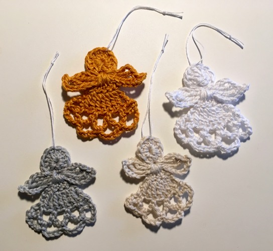

About a year and a half ago I got my mom to teach me how to crochet. I wasn't a craftsy person for most of my adult life, but after focusing on mental labour for so many years, I've come to appreciate the joy of working with my hands.

Once I moved to a place with a yard I took up gardening. Then a friend and I completed a college woodworking course, and I came out of it having built a pretty decent shelf and bench. But it's hard to garden or build things with a cat on your lap, so I needed something I could do while stretched out on the living room furniture, fulfilling my purpose as a cat bed.

Hence, crocheting. My first attempts were pretty amusing, at least to me, but I persevered and seemed to get the hang of it. And once I got started, I didn't want to stop.

For the first year or so I crocheted simply to crochet. I made simple things to give to people and a couple of things for myself, but the end result was kind of incidental to the process. I was more concerned with the act of crocheting than I was with what I was making.

Then my partner challenged / encouraged me to crochet my own Halloween decorations this year instead of simply buying more to add to the collection. And conveniently, a friend directed me to [ravelry.com](https://www.ravelry.com/), which led me to these two favourites, in particular:  [Lily Sugar 'n Cream Halloween Bat](https://spinrite.s3.amazonaws.com/assets/files/pattern-files/pdf/Lily_SugarnCreamweb108_cr_bat.en_US.pdf) and [Zeens and Roger Crochet House Spider](https://zeensandroger.wordpress.com/2016/09/30/a-crochet-house-spider-a-free-pattern-for-halloween/).

## Holiday crafting

Now Christmas is coming, and I continue to crochet with purpose. I just finished a commission for my sister: 24 Christmas angels, [using a pattern from Atty's](http://atty-s.blogspot.ca/2015/12/crochet-christmas-angels.html). The results are pictured here.

As you can see from the photo I used four different colours, all of them mercerized cotton. The different yard brands and weight, and to a lesser extent shifting between a 2.5mm and a 3mm hook, produced the variations in size.

From left to right is: Schachenmayr Catania fine (2) in silver (0172), Lion Brand 24/7 medium (4) in goldenrod (158), Paton's Grace light (3) in natural (62008), and Lion Brand 24/7 medium (4) in white (100).

The Lion Brand felt lighter than a usual 4, maybe because it's mercerized? This was my first time working with mercerized cotton. I couldn't really feel much difference between the Paton's 3 and the Schachenmayr 2. They both had a silkier texture than the heavier Lion Brand yarn, but the Paton's Grace had an especially silky feel. The angels took far less yarn than I was expecting, and I look forward to seeing what else I can make with this stuff.

But for now, I'm busy crocheting with purpose. That includes more holiday crafting over the next couple of weeks – a (second) stocking, some snow flakes... After that maybe it will be back to crocheting just for the sake of it for a while. I can't see myself making anything in the spirit of Valentine's Day!
