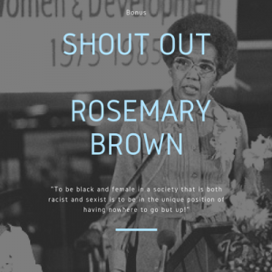
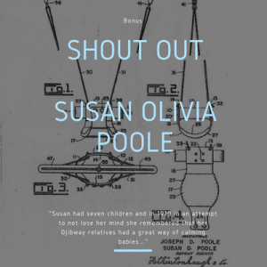
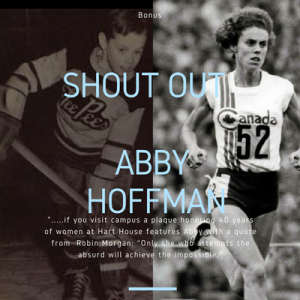

[One of my first posts on this young blog](https://www.lauramwiebe.com/2017/09/05/instead-sir-john-macdonald/) ended with a positive challenge to myself and others: to learn more about Canada's lesser known historical role models. Today I want to give a virtual high five to a podcast that is doing just that.

History podcasts are among my favourite. In seeking out more to hear I came across a local-ish podcast launched near the end of summer: _[The Secret Life of Canada](http://www.thesecretlifeofcanada.com/)_. Highly relevant to my interests, and maybe to yours too.

_The Secret Life of Canada_ is a podcast that digs beneath the textbooks, headlines and tourism PR to share stories about Canadian history that deserve to be more widely known. That in itself is commendable, but I'd also like to draw attention to a feature of the podcast that directly relates to the question of historical heroes.

Between regular episodes, hosts Leah Simone Bowen and Falen Johnson deliver bonus "Shout Out" mini-sodes, each highlighting someone from Canadian history who deserves more recognition.

The Shout Outs are short and to the point, and absolutely worth hearing. I'm sharing these bonus featurettes here, but please do head over to _The Secret Life of Canada_ and check out the full length episodes for yourself.

* * *

## Shout Out 1: Rosemary Brown

Did you know the name of the "first black Canadian woman to be elected to a provincial legislature"? Have you heard the campaign slogan she used when running for the leadership of the NDP (New Democratic Party)?

[soundcloud.com/secretlifeofcad/shout-out-rosemary-brown](https://soundcloud.com/secretlifeofcad/shout-out-rosemary-brown/)

<iframe src="https://w.soundcloud.com/player/?url=https%3A//api.soundcloud.com/tracks/344014485&amp;color=61dcf7" width="100%" height="166" frameborder="no" scrolling="no"></iframe>

## Shout Out 2: Susan Olivia Poole

Did you know which indigenous Canadian woman registered the patent for the Jolly Jumper?

[soundcloud.com/secretlifeofcad/shout-out-to-susan-olivia](https://soundcloud.com/secretlifeofcad/shout-out-to-susan-olivia/)

<iframe src="https://w.soundcloud.com/player/?url=https%3A//api.soundcloud.com/tracks/347240333&amp;color=61dcf7" width="100%" height="166" frameborder="no" scrolling="no"></iframe>

## Shout Out 3: Abby Hoffman

Are you aware of the Abby Hoffman Cup? Did you know she's the reason women can use the indoor running track at the University of Toronto's Hart House?

[soundcloud.com/secretlifeofcad/shout-out-to-abby-hoffman](https://soundcloud.com/secretlifeofcad/shout-out-to-abby-hoffman/)

<iframe src="https://w.soundcloud.com/player/?url=https%3A//api.soundcloud.com/tracks/352929872&amp;color=61dcf7" width="100%" height="166" frameborder="no" scrolling="no"></iframe>

* * *

Many thanks to **Leah Simone Bowen** and **Falen Johnson** ([www.thesecretlifeofcanada.com](http://www.thesecretlifeofcanada.com/)) for letting me share these Shout Outs with you here.

If anyone else out there has info on Canadians who deserve more recognition for their work and accomplishments, please chime in.
