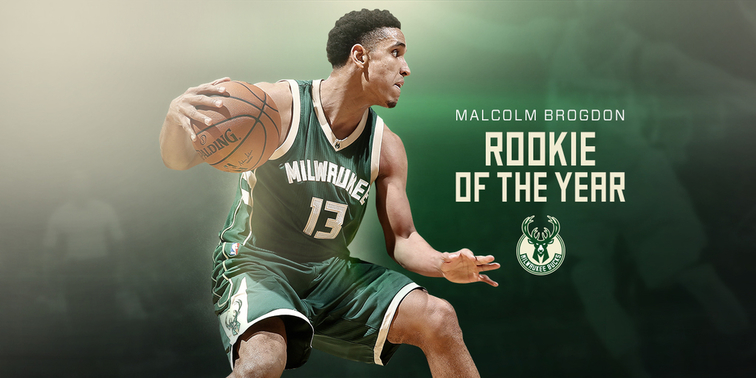

The answer to that question is Malcolm Brogdon. Though in the case of the NBA, his answer was more like "not yet" and, eventually, "yes."

* * *

Part of my immersion in all things NBA involves listening to sports podcasts, especially ones focused on basketball,  and the list of NBA podcasts I subscribe to includes [_The Starters_](http://www.nba.com/thestarters#/). I admit, this is partly a bit of nationalism, a tribute to the show's  Canadian origins. But it's also just because I find it entertaining.

A couple of weeks ago, on _The Starters' Twitter Show_, the hosts were drafting NBA players for their escape room dream teams. This was inspired by the Lakers' recent escape room / team bonding experience, and could make for a decent party game of sorts. But one of the comments got me thinking again about my interest in the connections between higher education and the NBA.

Here is what host J. E. Skeets had to say about why he'd want Malcolm Brogdon of the Milwaukee Bucks on his escape room team:

"He said no to both Harvard and the NBA in favour of going to Virginia, and staying five years, graduating with a master's degree in public policy, an undergrad in history... his nickname is The President..." (The Starters Twitter show, 14 November 14 2017)

I'm already slightly invested in Malcolm Brogdon because I joined the fantasy basketball world this year and he's on my team. But this new (to me) information, especially the part about the graduate degree in public policy, made me want to find out more. And here, I share what I found.

## NBA guard and scholar, Malcolm Brogdon

It seems like Brogdon had some early advantages when it comes to higher ed. [His mom has a PhD and a successful career at an institution called Morehouse College](http://www.morehouse.edu/academics/psychology/faculty.html). And his dad's no slouch either:  [he's a professional mediator and a former trial judge](http://www.acctm.org/gbrogdon/). I don't know what the Brogdon-Adams family dynamics are like, but I can imagine the kids being groomed for college from day one.

Malcolm Brogdon sounds like the kind of all around great guy you might want to hate but can't. Here's what I mean...

### An academic achiever and an all around good citizen

[Brogdon's roster profile on the Bucks' NBA site](http://www.nba.com/bucks/roster/malcolm-brogdon), after all the basketball stats, describes him as a high academic achiever:

a "member of Academic Honor Roll and the National Society of High School Scholars ..." who was "awarded the 2016 Ernest H. Ern Distinguished Student Award by the Virginia Alumni Association, given annually to a UVA student who has won recognition in the University community for demonstrating outstanding academic and leadership performance and for preserving the tradition of the University."

He's only been out of college for a short time, but his jersey has already been retired by the Virginia Cavaliers. NCAA and University of Virginia reporting on this adds even more glowing commendations to Brogdon's CV. His former head coach declared that Malcolm:

"represented everything that is right about being a true student-athlete. What a model for making an impact on the court, in the classroom and the community."

And here again, in addition to basketball honours, his achievements outside the court are recognized:

"Brogdon was a Senior CLASS Award and Allstate NABC Good Works Team honoree, and John R. Wooden Citizenship Cup finalist for his excellence in the classroom and community."

So he's smart, gifted in sports, and works hard to make the most of these advantages. But [apparently he's humble as well](http://ftw.usatoday.com/2015/10/uva-standout-malcolm-brogdon-has-dreams-beyond-the-nba-fighting-world-hunger). And his post-NBA dreams are geared toward fighting inequality internationally.

### A future leader and philanthropist

Hunger and poverty in Ghana are particular focal points of Malcolm Brogdon's desire for change. A childhood trip to Africa, where he learned what hunger truly looks like, motivates Brogdon to this day, but now he's better prepared to respond to what he witnessed.

Several Malcolm Brogdon features published over the last few years attest to these charitable goals:

"Brogdon has thought about working for the Clinton Foundation or the Bill and Melinda Gates Foundation to gain more experience in how NGOs with a lot of money work, so he perhaps could build one from the ground up some day." ([ftw.usatoday.com](http://ftw.usatoday.com/2015/10/uva-standout-malcolm-brogdon-has-dreams-beyond-the-nba-fighting-world-hunger))

Brogdon also hopes to \[...\] use his time in the NBA to build connections and obtain resources to eventually start a non-profit organization that reduces poverty in Third World countries." ([nbapa.com](https://nbpa.com/collecting-points-and-degrees-malcolm-brogdon-shines-as-a-roy-candidate-and-public-policy-champion/))

"... some day he endeavors to take his college degree in public policy and go to underdeveloped countries where he will teach their people about clean water and sustainability with their own crops.

'People always ask me, why not domestically? Why internationally?” said Brogdon. “I know we have a lot of poverty and we have a lot of problems over here in the U.S., but for me, I’ve been outside the country, and that’s really where my heart is – to help others outside.'" ([jsonline.com](https://www.jsonline.com/story/sports/nba/bucks/2016/12/17/brogdons-goals-reach-beyond-court/95337090/))

And as if that's not enough, how about this. You may have heard Brogdon was [last year's NBA Rookie of the Year](http://www.nba.com/nbaawards/2017/finalists#/). Well, according to [a feature on the NBA Players' Associate site](https://nbpa.com/collecting-points-and-degrees-malcolm-brogdon-shines-as-a-roy-candidate-and-public-policy-champion/): "he asked the Bucks to not campaign on his behalf, but rather put the money that would have been used towards a charity."

\[caption id="attachment\_267" align="aligncenter" width="756"\] Image credit: NBA.com.\[/caption\]

### ... who said no to Harvard

Not everyone is meant for higher education. And far fewer people are meant for professional sports. Pursuing both at the same time and succeeding – well, that's even rarer. It's clear Malcolm Brogdon had to commit to living his life in a certain way to achieve what he has. But he definitely made some important decisions and had some crucial help along the way.

Brogdon could have attended Harvard, yes. But he didn't because he wanted to study _and_ to play basketball. Apparently going to the University of Virginia allowed him to do both. [According to _USA Today Sports_](http://ftw.usatoday.com/2015/10/uva-standout-malcolm-brogdon-has-dreams-beyond-the-nba-fighting-world-hunger), coach Tony Bennett was willing to adapt the Cavaliers' practice schedule around classes Brogdon couldn't miss. That signals support and respect.

Another key move in Brogdon's career so far was his decision to delay entering the NBA draft. In the "one and done" era when the top draft picks spend the minimum amount of time in college, Brogdon stayed at Virginia for five years. He earned that bachelor's degree in history and then stayed on to graduate with that master's degree in public policy. It's not a choice every star athlete can or should make. But it says a lot about Brogdon and his potential future throughout and after his time in the NBA.

* * *

I don't know Malcolm Brogdon. Chances are I'll never meet him. I don't know what he's like to be around or live with. But I can watch his game and respect his chosen path. And though it doesn't mean anything to anyone but me, I'm honoured to have him on my NBA fantasy team.

* * *

_**p.s.**_ I also found a story that names Malcolm Brogdon [the only NBA player to have an agent who is also a woman](https://onmilwaukee.com/sports/articles/bucks-malcolm-brogdon-has-female-agent.html).

* * *

## Sources / further reading

[Malcolm Brogdon's Wikipedia profile](https://en.wikipedia.org/wiki/Malcolm_Brogdon)

[#13 | Malcolm Brogdon | Milwaukee Bucks](http://www.nba.com/bucks/roster/malcolm-brogdon)

[UVA standout Malcolm Brogdon has dreams beyond the NBA: fighting world poverty and hunger](http://ftw.usatoday.com/2015/10/uva-standout-malcolm-brogdon-has-dreams-beyond-the-nba-fighting-world-hunger)

[Brogdon's goals reach beyond the court](https://www.jsonline.com/story/sports/nba/bucks/2016/12/17/brogdons-goals-reach-beyond-court/95337090/)

[Collecting Points and Degrees, Malcolm Brogdon Shines as a ROY Candidate and Public Policy Champion](https://nbpa.com/collecting-points-and-degrees-malcolm-brogdon-shines-as-a-roy-candidate-and-public-policy-champion/)

[College basketball: Virginia to retire Malcolm Brogdon's No. 15 jersey](http://www.ncaa.com/news/basketball-men/article/2016-12-15/college-basketball-virginia-retire-malcolm-brogdons-no-15)

[Malcolm Brogdon to join UVA’S basketball legends as his number is retired](https://news.virginia.edu/content/malcolm-brogdon-join-uvas-basketball-legends-his-number-retired)

[2017 NBA Awards Complete List Of Winners](http://www.nba.com/nbaawards/2017/finalists#/)

[Malcolm Brogdon wins NBA Rookie of the Year](http://www.nba.com/bucks/malcolm-brogdon-wins-nba-rookie-year)

[The only NBA player with a female agent, Malcolm Brogdon speaks on social issues](https://onmilwaukee.com/sports/articles/bucks-malcolm-brogdon-has-female-agent.html)

Feature photo credit: David Bernacchi.
